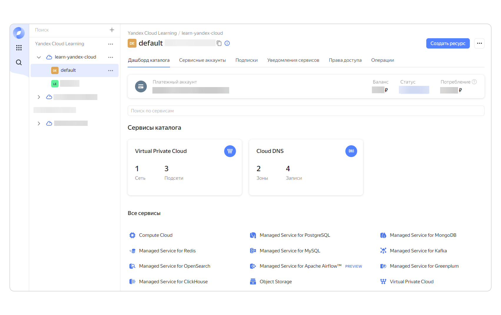
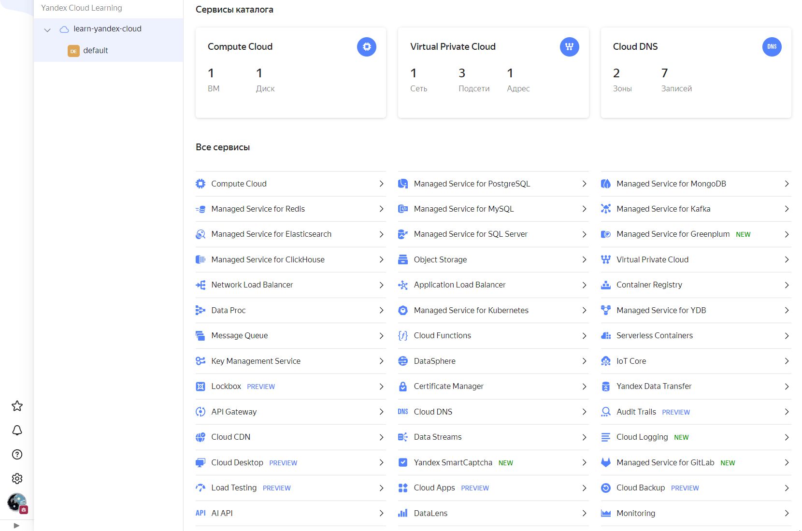
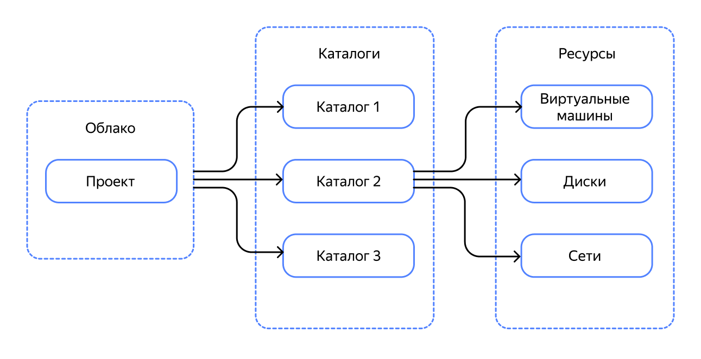
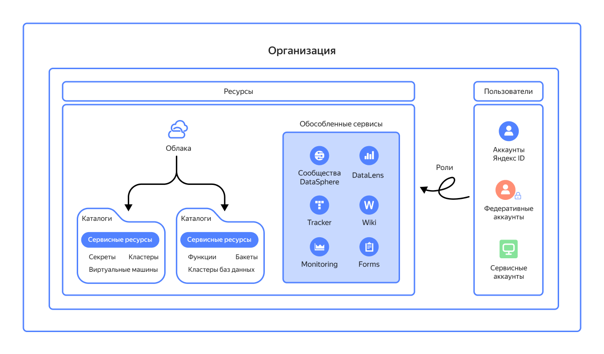
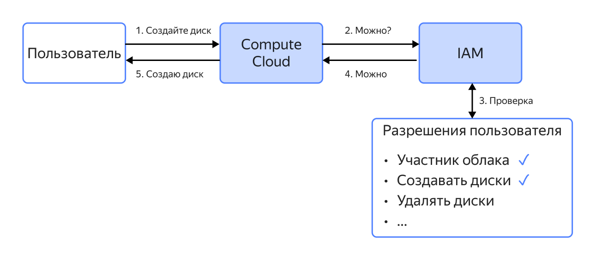
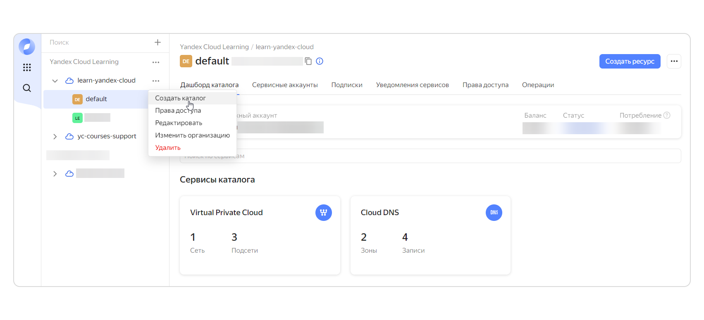
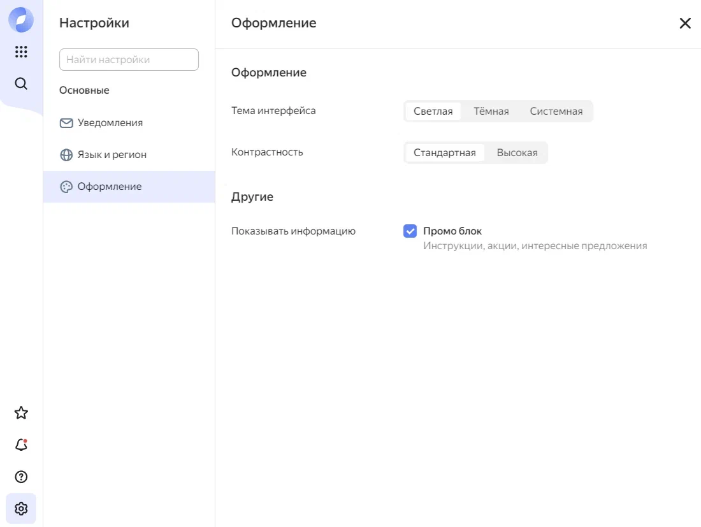
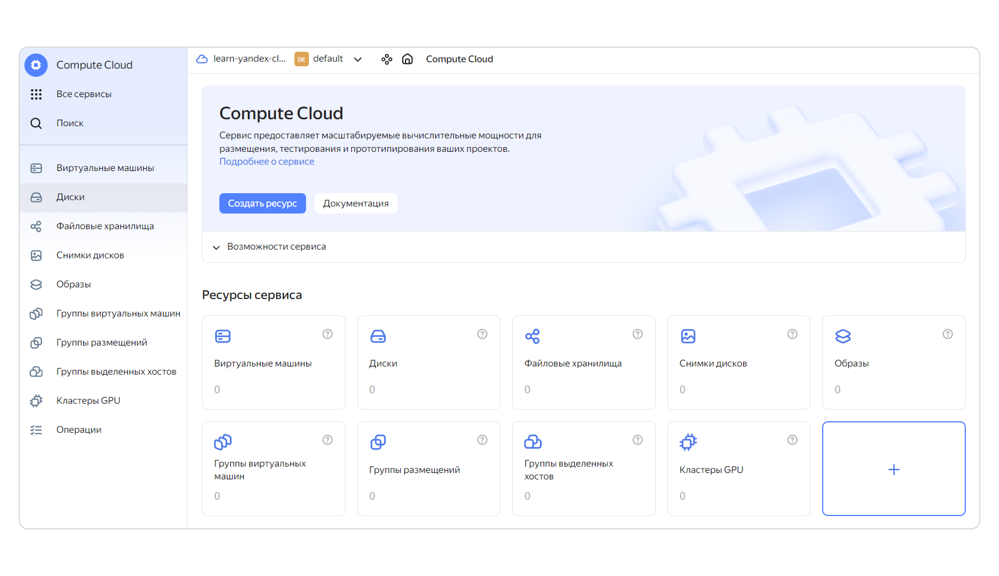

# Заметки по курсу Яндекс Cloud

## Тема 3: Первое знакомство с облаком

**Время:** ~95 минут | **Уроков:** 7

### Урок 1: О чём эта тема

При работе с облаком важно уметь управлять ресурсами. Разберёмся с основами управления облаком, различиями между инструментами и ролями доступа, научимся оптимально использовать ресурсы Yandex Cloud.

**Что узнаем:**
- как управлять облаком через консоль, командную строку и API
- структура облака, параметры и ограничения
- роли для разных задач в облаке (безопасность и гибкость)
- использование консоли для управления ресурсами
- сервисы Yandex Cloud
- поиск информации в документации

**Результат:** теоретические знания + практические навыки работы с облачными ресурсами

### Урок 2: Как управлять облаком

**Инструменты управления:**
- Консоль управления (веб-интерфейс, web UI)
- Интерфейс командной строки (CLI)
- API (Application Programming Interface)

**Консоль управления:**
- Веб-страница, которую видим при создании облака
- Можно создавать/удалять ресурсы, изменять конфигурацию, мониторить, следить за расходами
- Работа через несколько кликов



**API:**
- Набор определений и протоколов для взаимодействия приложений
- Позволяет приложениям запрашивать данные друг у друга

**Пример: получение информации о ВМ "test"**

1. **Через консоль:**
   - Открыть Compute Cloud
   - Выбрать ВМ в списке
   - Перейти на страницу с параметрами



2. **Через CLI:**
   ```bash
   yc compute instance get --full test
   ```

3. **Через API:**
   ```
   GET https://compute.api.cloud.yandex.net/compute/v1/instances/{instanceId}
   ```
   где `instanceId` — идентификатор виртуальной машины

**В курсе:** работа через консоль и CLI (CLI — отдельная тема)

### Урок 3: Базовые понятия

**Разберём:**
- облачные ресурсы и их иерархию
- квоты и лимиты облаков
- пользователей и типы аккаунтов

#### Облачные ресурсы и их иерархия

**Облачные ресурсы** — всё, что можно создать в облаке: ВМ, диски, сети, ключи шифрования и т.д.

**Каталоги** — группы ресурсов для быстрого поиска

**Облако** — личное рабочее пространство на облачной платформе
- По умолчанию изолировано от других пользователей
- Можно создать несколько облаков для разных проектов

**Иерархия: Облако → Каталог → Ресурс**

Аналогия с компьютером:
- Облако = личный диск
- Каталоги = папки
- Ресурсы = файлы

**Отличие:** ресурсы не могут быть в корне, они должны принадлежать каталогу. В каждом облаке должен быть минимум один каталог. В новом облаке автоматически создаётся каталог `default`.



**Организации** — верхний уровень иерархии
- Объединяют разные типы ресурсов и пользователей
- Организации принадлежит всё: облака, каталоги, ресурсы, обособленные сервисы, пользователи



**Обособленные сервисы:**
- Хранят ресурсы самостоятельно, без каталогов облака
- Могут обмениваться информацией с другими сервисами в рамках организации
- Примеры: Yandex DataLens, Yandex DataSphere

#### Квоты и лимиты

**Квоты** — "мягкие" организационные ограничения
- Не дают занять слишком много ресурсов
- Гарантируют стабильную работу платформы
- Можно увеличить через запрос в техподдержку

**Лимиты** — технические ограничения, физический предел
- Связаны с архитектурой платформы
- Изменить невозможно

**Примеры ограничений:**
- Не более 2 виртуальных сетей
- Не более 12 виртуальных машин
- ВМ не более 32 виртуальных процессоров

📚 Перечень квот и лимитов — в документации

**Рекомендация:** для сложных задач заранее расширить квоту

#### Пользователи и типы аккаунтов

**Пользователь** — человек или приложение, взаимодействующее с ресурсами

**Аккаунт** — учётная запись для идентификации пользователей

**Типы аккаунтов:**

1. **Яндекс ID** — единый аккаунт во всех сервисах Яндекса
2. **Федеративный аккаунт** — аккаунт во внешней системе с SSO (Active Directory)
3. **Сервисный аккаунт** — для приложений и инструментов автоматизации

Аккаунты принадлежат организации.

#### Доступ к ресурсам

**Аутентификация** — подтверждение личности пользователя
- Яндекс ID: автоматически
- Сервисные аккаунты: IAM-токен, API-ключ, статические ключи доступа

**Авторизация** — проверка разрешений на операцию
- Все запросы проверяются в сервисе IAM (Identity and Access Management)

**Процесс проверки доступа (пример: создание диска):**

1. Пользователь просит Compute Cloud создать диск
2. Compute Cloud спрашивает IAM о разрешениях
3. IAM проверяет: участник ли облака, есть ли разрешения
4. Если нет разрешений — ошибка, если есть — успех
5. Compute Cloud создаёт диск



#### Роли на ресурс

**RBAC (Role-Based Access Control)** — управление доступом на основе ролей

**Роль** — набор разрешений для операций над ресурсом

**Примитивные роли** (4 штуки, для всех типов ресурсов):
- `admin` — любые операции, включая предоставление доступа
- `editor` — управление ресурсом
- `viewer` — просмотр информации
- `auditor` — только просмотр информации

**Сервисные (гранулярные) роли:**
- Разрешения только для определённого типа ресурсов в конкретном сервисе
- Много ролей, у каждого сервиса свои
- Реализуют принцип "минимальных полномочий"
- Помогают избежать последствий при компрометации

📚 Полный список ролей — в документации

**Роль по умолчанию:** `resource-manager.clouds.owner`
- Неограниченный доступ в своём облаке
- Можно создавать, изменять, удалять ресурсы
- Назначать и отзывать роли

**Наследование ролей:**
- Роль `editor` на облако → управление ресурсами во всех каталогах
- Роль `editor` на каталог → управление ресурсами только в этом каталоге

### Урок 4: Консоль управления

**Консоль управления (веб-интерфейс)** — наглядный и интуитивно понятный инструмент для работы с облаком.

#### Дашборд каталога

**Элементы навигации:**
- Вертикальная панель слева
- Горизонтальная панель сверху

.png)

**Вертикальная панель:**
- Список облаков и каталогов
- Значок "+" сверху — создать новое облако
- Три точки справа от облака — создать новый каталог



**Верхняя панель навигации:**
- Показывает текущий каталог
- Плашка с информацией о платёжном аккаунте:
  - Статус лицевого счёта
  - Баланс средств
  - Расход за последние 30 дней

**Раздел "Сервисы каталога":**
- Информация о используемых сервисах
- Количество созданных ресурсов
- Клик по плашке → переход в сервис

**Раздел "Все сервисы":**
- Ссылки на все сервисы Yandex Cloud

**Кнопка "Создать ресурс"** (правый верхний угол):
- Выпадающее меню
- Создание ресурса без перехода на страницу сервиса

**Вертикальная служебная панель (слева):**
- Логотип Yandex Cloud
- Иконка "Все сервисы" (9 точек)
- Ссылки: Биллинг, Техподдержка
- Панель со списком всех сервисов (можно закрепить часто используемые)

**Иконки внизу служебной панели:**
- ⭐ Звёздочка — добавить ресурс в избранное
- 🔔 Колокольчик — уведомления
- ❓ Вопрос — документация/техподдержка
- ⚙️ Шестерёнка — настройки консоли

**Настройки консоли:**
- Форматы уведомлений
- Язык интерфейса
- Часовой пояс
- Отображение даты и времени
- Оформление (включая тёмную тему)



#### Страницы сервисов

**Изменения на странице сервиса:**
- На служебной панели появляются иконки разделов сервиса
- Можно развернуть панель (треугольник в левом нижнем углу) для надписей



**Верхняя панель навигации:**
- 🏠 "Домик" — вернуться на дашборд каталога
- 🐾 "Лапка" — перемещение между ресурсами без возврата в дашборд
- Слева: текущее облако и каталог
- Значок уголка → выпадающее окно для переключения между облаками/каталогами
- Справа от "домика": ссылки на разделы текущей страницы

**Возможности:**
- Легкое переключение между облаками, каталогами и сервисами
