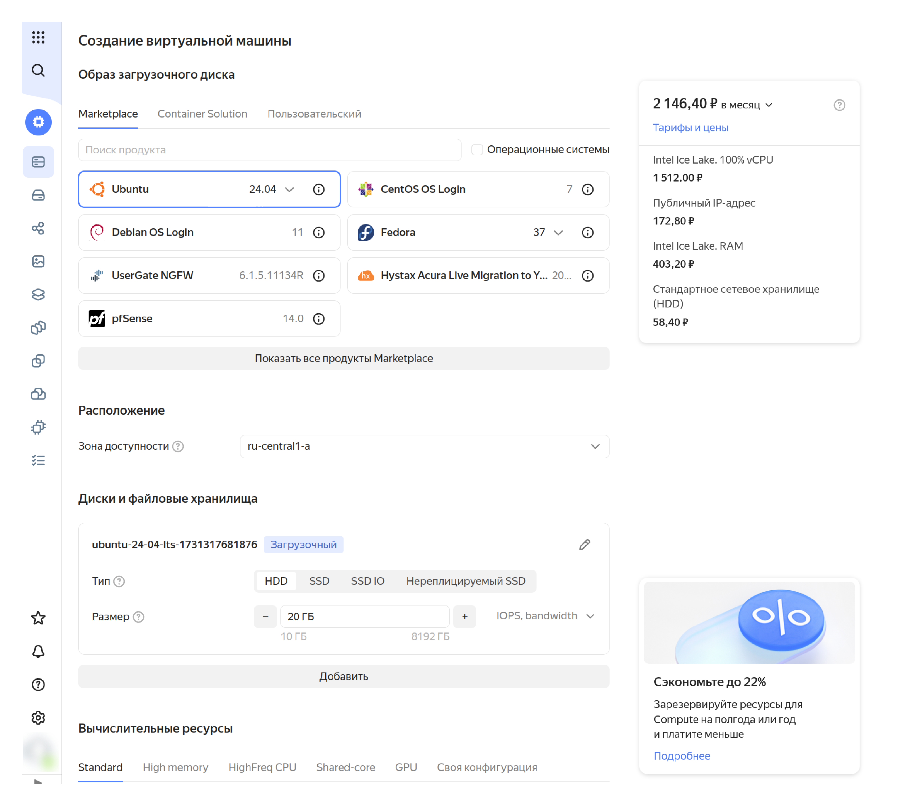
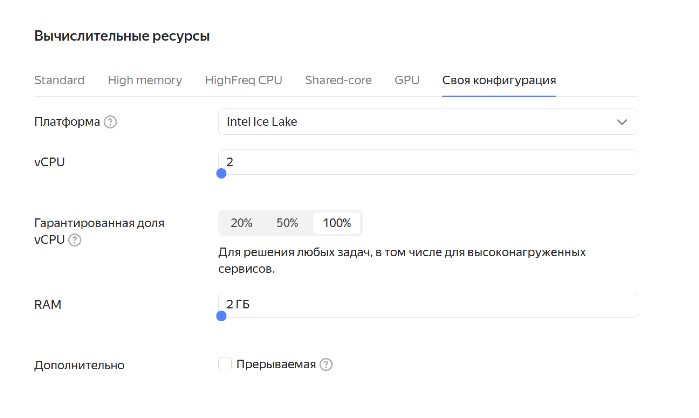
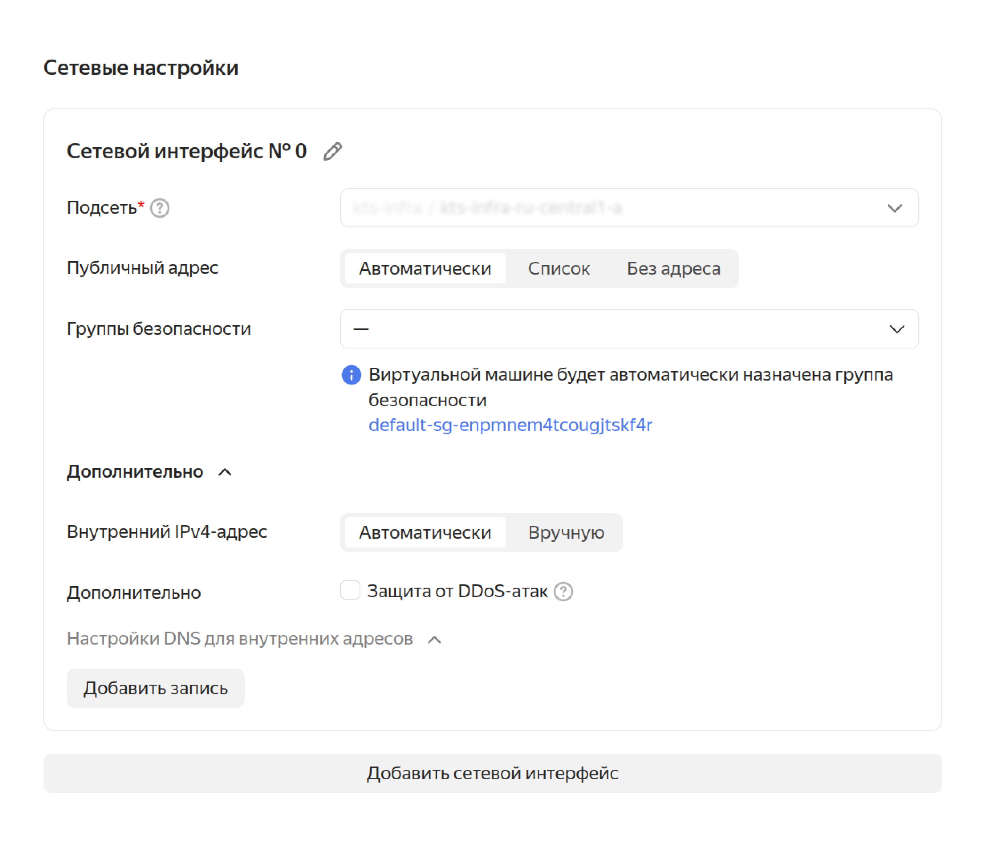
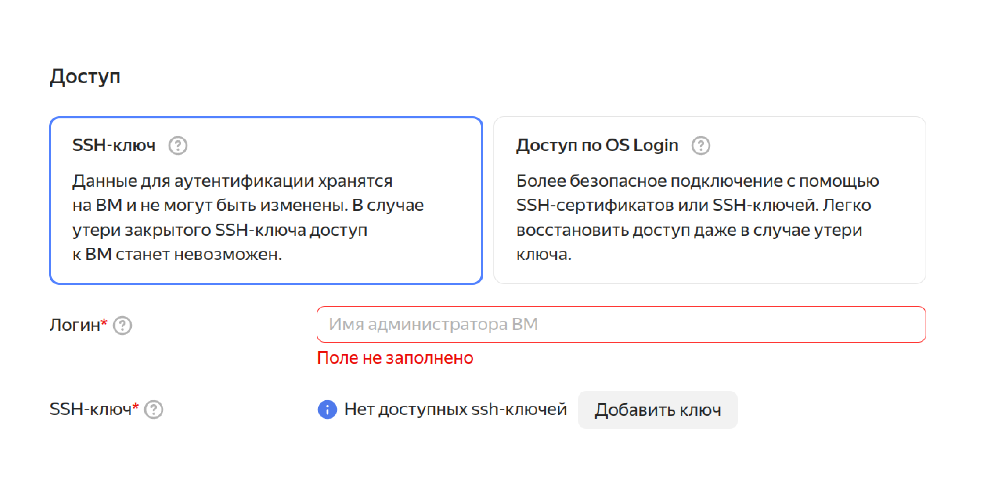
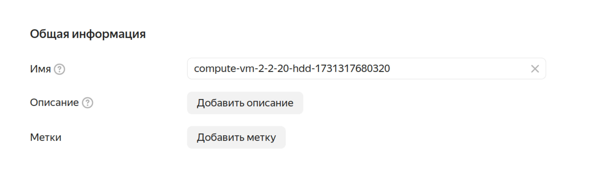
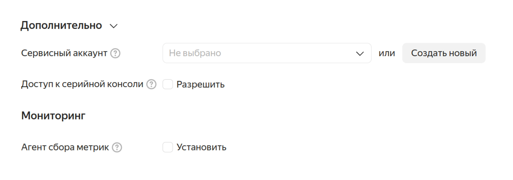

# Заметки по курсу Яндекс Cloud

## Тема: Виртуальные машины

**⏳ Время прохождения темы:** около 3 часов

### Урок 1: О чём эта тема

**Виртуальные машины (ВМ)** — один из ключевых инструментов в облачной среде.

**Возможности:**
- Запуск операционных систем и приложений без привязки к физическому оборудованию
- Гибкость и оптимизация затрат на инфраструктуру

**Что узнаем:**
- что такое виртуализация и как работают ВМ
- когда использование ВМ предпочтительнее физических серверов
- какие параметры задавать при создании ВМ в Yandex Cloud
- как создать пару SSH-ключей для безопасного подключения
- как создать и настроить ВМ через графический интерфейс и командную строку
- как подключиться к ВМ через SSH
- как уменьшить стоимость использования ВМ и настроить контроль затрат
- как использовать CLI Yandex Cloud для управления ВМ
- как подключаться через OS Login
- что такое метаданные ВМ и как они помогают автоматизировать управление

**В следующем уроке:** создадим первую ВМ и подключимся к ней!

### Урок 2: Что такое виртуальная машина

**В основе облачных вычислений** — виртуализация.

#### Что такое виртуализация

**Виртуализация** — технология, которая позволяет создавать на одном физическом компьютере несколько виртуальных машин (ВМ), каждая из которых работает как отдельный компьютер.

**Аналогия:** один большой компьютер делится на несколько маленьких, каждый со своей ОС и программами.

**Особенности:**
- Обычно на компьютере одна ОС, ресурсы загружены не полностью
- Виртуализация делит компьютер на несколько ВМ с разными мощностями и ОС (гостевыми)
- ВМ работают одновременно и полноценно используют физические ресурсы
- ВМ изолированы друг от друга: программа на одной ВМ не может вмешаться в работу других

**Гипервизор** — слой ПО, который:
- Создаёт среду для работы ВМ
- Обеспечивает изоляцию ВМ друг от друга
- Разделяет ресурсы

**Виртуализация** = процесс, **ВМ** = итог процесса

#### Что такое виртуальные машины

**ВМ в Yandex Cloud:**
- Аналог физического сервера в облачной инфраструктуре
- Физически находится на сервере в дата-центре Yandex Cloud
- Ресурсы размещены в одной из трёх зон доступности

**Для создания ВМ нужен образ (снимок) загрузочного диска:**
- Содержит ОС и системные файлы для запуска ВМ
- Можно использовать:
  - Стандартные образы Yandex Cloud (различные Linux)
  - Образы с предустановленным софтом из Cloud Marketplace
  - Собственные образы

**При создании ВМ подключается:**
- Сетевой интерфейс
- Один или несколько виртуальных дисков
- Выделяются вычислительные ресурсы: виртуальные процессоры и память
- На загрузочный диск устанавливается ОС

**Для установки/настройки софта:** нужно подключиться к ВМ (со своего компьютера или с другой ВМ в облаке)

#### Преимущества виртуальных машин

**Виртуализация позволяет:**
- Проще создавать необходимую инфраструктуру
- Более эффективно использовать физические ресурсы
- Легче администрировать legacy-приложения (которые не работают на современных системах)
- Быстрее и проще тестировать разрабатываемый софт

**Пример: развёртывание интернет-магазина**
1. Создать ВМ из образа с предустановленной CMS (например, OpenCart)
2. Зайти в административную панель OpenCart
3. Настроить внешний вид и эквайринг
4. Добавить товары
5. Настроить перенаправление в панели регистратора доменных имён

**Преимущества облачной платформы:**
- Гарантированное выделение указанного количества ресурсов
- Возможность нарастить ресурсы при необходимости
- Автоматическое масштабирование (количество ВМ подстраивается под нагрузку)
- Резервные копии данных в несколько кликов

#### Когда ВМ подойдёт вам

**1. Неопределённость в ресурсах:**
- Знаете, сколько ресурсов нужно сейчас, но не уверены в будущем
- "Железные" серверы сложнее получить в нужной конфигурации и отказаться от них
- ВМ в облаке — гибкое решение

**2. Периодические ресурсоёмкие задачи:**
- Преобразование файлов, обработка изображений, сложные вычисления
- Не нужно покупать оборудование — арендуете ресурсы
- Когда не нужны — останавливаете или удаляете

**3. Тестирование и прототипирование:**
- Удобно проверять тестовые версии продуктов
- Нагрузочное, функциональное и регрессионное тестирование
- Быстрое создание прототипов и проверка идей на ранних стадиях

### Урок 3: Страница создания ВМ

**ВМ создаются в одном из каталогов облака.** Можно перемещать между каталогами в рамках облака. Перенос в другое облако требует более сложных действий.

#### Переход к странице создания ВМ

**Шаги:**
1. Перейти в консоль управления Yandex Cloud
2. Выбрать каталог (убедиться, что в нём есть виртуальная сеть)
3. Нажать "Создать ресурс" → "Виртуальная машина"

#### Образ загрузочного диска

**Образ** — для быстрого создания диска с данными (загрузочного диска ВМ).

**Типы образов:**
- **Операционные системы** — стандартные дистрибутивы ОС с базовыми сервисами
- **Container Solution** — образ ВМ на базе Ubuntu, оптимизированный для Docker-контейнеров
- **Marketplace** — дистрибутивы ОС с предустановленным ПО (1С:Предприятие, WordPress, OpenVPN Access Server). Готовые лицензированные решения от Yandex Cloud и партнёров
- **Пользовательский** — собственный загрузочный диск, снимок или образ

#### Расположение

**Зона доступности** — определяет дата-центр, ресурсы которого будут задействованы для ВМ.

#### Диски

**Загрузочный диск:**
- Появляется автоматически при выборе ОС
- Используется для загрузки ОС

**Параметры диска:**
- **Тип диска:** HDD, SSD, нереплицируемый SSD, SSD-IO (высокопроизводительный SSD)
- **Размер** — в гигабайтах
- **Производительность:**
  - IOPS — максимальное количество операций чтения/записи в секунду
  - Bandwidth — максимальная пропускная способность в МБ/с

💡 Производительность диска зависит от размера: чем больше размер, тем выше производительность.

**Дополнительные диски** — можно подключить (подробнее в следующей теме).

#### Вычислительные ресурсы

**Нужно указать:**
- Количество и производительность ядер процессора (vCPU — виртуальный процессор)
- Количество памяти (RAM)

**При изменении нагрузки:** можно остановить ВМ и изменить конфигурацию.

**Готовые конфигурации:**
- Standart
- High memory
- HighFreq CPU
- Shared-core
- GPU

**Своя конфигурация:**
- **Платформа** — по умолчанию Intel Ice Lake (можно выбрать другую, например для GPU)
- **vCPU** — число ядер виртуального процессора
- **RAM** — объём оперативной памяти
- **Гарантированная доля vCPU** — если менее 100%, ВМ имеет доступ к мощности минимум на выбранный процент времени. Дешевле, подходит для приложений без высокой производительности
- **Прерываемая ВМ** — работа может быть прервана провайдером, предоставляется со скидкой

#### Сетевые настройки

**Параметры сетевого интерфейса:**
- Внутренний и публичный IP-адреса
- Группы безопасности
- Подсеть (обязательно для создания ВМ)

**Подсеть:**
- Выбрать из выпадающего списка
- Показываются подсети для выбранной зоны доступности

**Внутренний IPv4-адрес:**
- Для взаимодействия с другими сервисами во внутренней облачной сети

**Публичный адрес:**
- **Автоматически** — случайный IP из пула Yandex Cloud, сохраняется при перезагрузке, высвобождается при остановке
- **Из списка** — выбрать из зарезервированных статических адресов (не пропадают при остановке)
- **Без адреса** — только внутренний IP

**Несколько сетевых интерфейсов:** можно добавить отдельный публичный адрес на каждый.

**Группа безопасности** — для ограничения доступа к ВМ.

**Настройки DNS** — для внутренних адресов, задание DNS-записей для подключения с других машин внутри сети.

#### Доступ

**Способы подключения к ВМ с Linux:**
1. **OS Login** — через сервисные аккаунты или пользователей с помощью IAM
2. **SSH** — через ключ для доступа (можно загрузить при создании ВМ)

📚 ВМ с Windows запускаются с включённым RDP (см. документацию)

💻 Не использовать логин root, admin или другие зарезервированные имена. Для операций с правами суперпользователя использовать `sudo`.

#### Общая информация

**Идентификатор (ID):**
- Генерируется автоматически
- Уникален в пределах всей облачной платформы

**Имя ВМ:**
- Придумывается самостоятельно
- Должно быть уникальным в пределах каталога
- Требования:
  - Длина: 3-63 символа
  - Состав: строчные буквы латинского алфавита, цифры и дефисы
  - Первый символ — буква
  - Последний символ — не дефис

**Описание:**
- Любая информация о ВМ как заметка
- Пример: "Сервер для тестирования нового приложения"

**Метки (теги):**
- Формат: ключ:значение
- Примеры: `application:frontend`, `purpose:testing`, `project:x`
- Помогают группировать машины в отчётах и фильтровать в консоли

#### Дополнительно

**Сервисный аккаунт:**
- Для взаимодействия ВМ с ресурсами облака
- От имени аккаунта (при наличии разрешений) ВМ может:
  - Отправлять метрики в Monitoring
  - Отправлять логи в Cloud Logging
  - Подключаться к Cloud Backup
- Преимущество: настройка прав доступа для приложений на ВМ (принцип минимальных полномочий)

**Агент сбора метрик:**
- Сбор информации о состоянии ВМ и приложений
- Отправка в Yandex Monitoring и Cloud Logging

**Серийная консоль:**
- Аналог консольного порта оборудования
- Доступ к ВМ вне зависимости от состояния сети или ОС
- Для устранения неисправностей

#### Метаданные

**Метаданные** — дополнительная информация, передаваемая внутрь ВМ при запуске.

**Использование:**
- Автоматизация настроек и конфигураций
- Без непосредственного вмешательства пользователя после запуска

Подробнее о метаданных — в следующих уроках.

