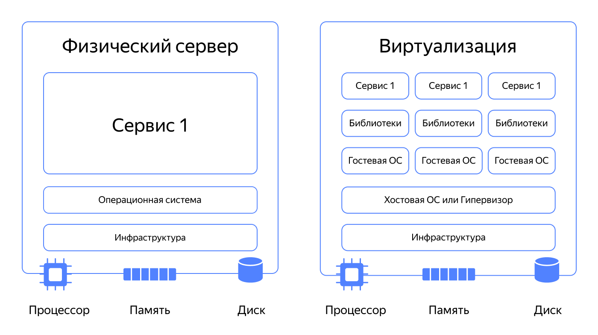

# Заметки по курсу Яндекс Cloud

## Тема: Виртуальные машины

**⏳ Время прохождения темы:** около 3 часов

### Урок 1: О чём эта тема

**Виртуальные машины (ВМ)** — один из ключевых инструментов в облачной среде.

**Возможности:**
- Запуск операционных систем и приложений без привязки к физическому оборудованию
- Гибкость и оптимизация затрат на инфраструктуру

**Что узнаем:**
- что такое виртуализация и как работают ВМ
- когда использование ВМ предпочтительнее физических серверов
- какие параметры задавать при создании ВМ в Yandex Cloud
- как создать пару SSH-ключей для безопасного подключения
- как создать и настроить ВМ через графический интерфейс и командную строку
- как подключиться к ВМ через SSH
- как уменьшить стоимость использования ВМ и настроить контроль затрат
- как использовать CLI Yandex Cloud для управления ВМ
- как подключаться через OS Login
- что такое метаданные ВМ и как они помогают автоматизировать управление

**В следующем уроке:** создадим первую ВМ и подключимся к ней!

### Урок 2: Что такое виртуальная машина

**В основе облачных вычислений** — виртуализация.

#### Что такое виртуализация

**Виртуализация** — технология, которая позволяет создавать на одном физическом компьютере несколько виртуальных машин (ВМ), каждая из которых работает как отдельный компьютер.

**Аналогия:** один большой компьютер делится на несколько маленьких, каждый со своей ОС и программами.

**Особенности:**
- Обычно на компьютере одна ОС, ресурсы загружены не полностью
- Виртуализация делит компьютер на несколько ВМ с разными мощностями и ОС (гостевыми)
- ВМ работают одновременно и полноценно используют физические ресурсы
- ВМ изолированы друг от друга: программа на одной ВМ не может вмешаться в работу других

**Гипервизор** — слой ПО, который:
- Создаёт среду для работы ВМ
- Обеспечивает изоляцию ВМ друг от друга
- Разделяет ресурсы

**Виртуализация** = процесс, **ВМ** = итог процесса

#### Что такое виртуальные машины

**ВМ в Yandex Cloud:**
- Аналог физического сервера в облачной инфраструктуре
- Физически находится на сервере в дата-центре Yandex Cloud
- Ресурсы размещены в одной из трёх зон доступности

**Для создания ВМ нужен образ (снимок) загрузочного диска:**
- Содержит ОС и системные файлы для запуска ВМ
- Можно использовать:
  - Стандартные образы Yandex Cloud (различные Linux)
  - Образы с предустановленным софтом из Cloud Marketplace
  - Собственные образы

**При создании ВМ подключается:**
- Сетевой интерфейс
- Один или несколько виртуальных дисков
- Выделяются вычислительные ресурсы: виртуальные процессоры и память
- На загрузочный диск устанавливается ОС

**Для установки/настройки софта:** нужно подключиться к ВМ (со своего компьютера или с другой ВМ в облаке)

#### Преимущества виртуальных машин

**Виртуализация позволяет:**
- Проще создавать необходимую инфраструктуру
- Более эффективно использовать физические ресурсы
- Легче администрировать legacy-приложения (которые не работают на современных системах)
- Быстрее и проще тестировать разрабатываемый софт

**Пример: развёртывание интернет-магазина**
1. Создать ВМ из образа с предустановленной CMS (например, OpenCart)
2. Зайти в административную панель OpenCart
3. Настроить внешний вид и эквайринг
4. Добавить товары
5. Настроить перенаправление в панели регистратора доменных имён

**Преимущества облачной платформы:**
- Гарантированное выделение указанного количества ресурсов
- Возможность нарастить ресурсы при необходимости
- Автоматическое масштабирование (количество ВМ подстраивается под нагрузку)
- Резервные копии данных в несколько кликов

#### Когда ВМ подойдёт вам

**1. Неопределённость в ресурсах:**
- Знаете, сколько ресурсов нужно сейчас, но не уверены в будущем
- "Железные" серверы сложнее получить в нужной конфигурации и отказаться от них
- ВМ в облаке — гибкое решение

**2. Периодические ресурсоёмкие задачи:**
- Преобразование файлов, обработка изображений, сложные вычисления
- Не нужно покупать оборудование — арендуете ресурсы
- Когда не нужны — останавливаете или удаляете

**3. Тестирование и прототипирование:**
- Удобно проверять тестовые версии продуктов
- Нагрузочное, функциональное и регрессионное тестирование
- Быстрое создание прототипов и проверка идей на ранних стадиях

